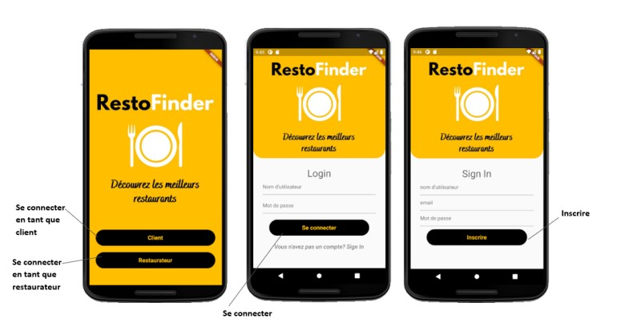
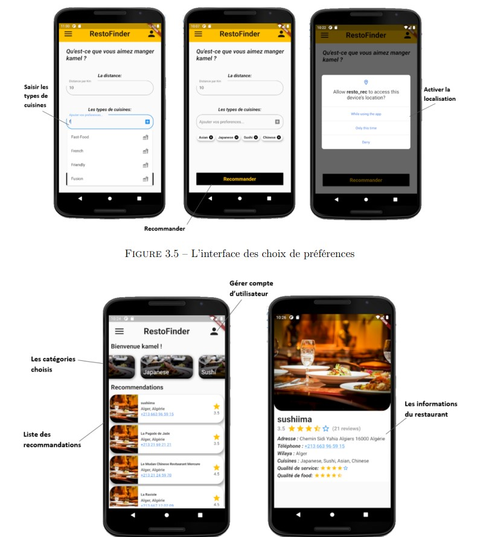

# Recommanded-system-for-algerian-restaurant_flutter_app

L’objet de ce projet de fin d’études de licence est la réalisation d’un système de recommandation de restaurants pour notre pays l’Algérie.
Notre approche est basé sur le contenu et ce selon les préférences des utilisateurs où nous avons pris en considération plusieurs critères comme : les types de cuisines, la qualité de service, ainsi que la proximité par rapport aux clients pour générer dynamiquement les résultats de la recommandation. Nous avons appliqué les algorithmes TF/IDF et Similarité cosinus pour générer les recommandations aux utilisateurs. Nous avons utilisé des datasets élaboré par nous-mêmes. Le système de recommandation que nous avons construit est capable de fournir aux utilisateurs des choix variés et intéressants à travers l’application mobile RestoFinder que nous avons développé pour intégrer notre systéme de recommandation de restaurants.

## Application 

